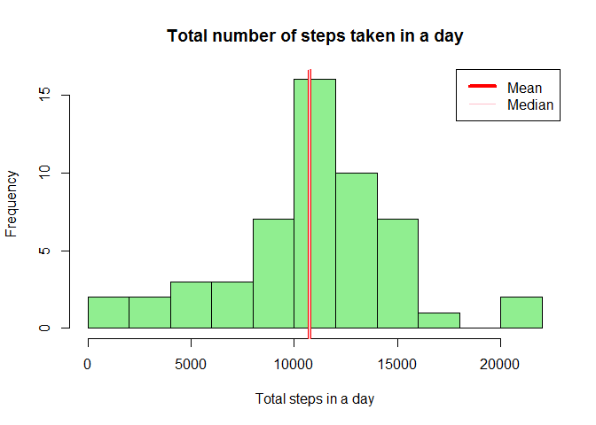
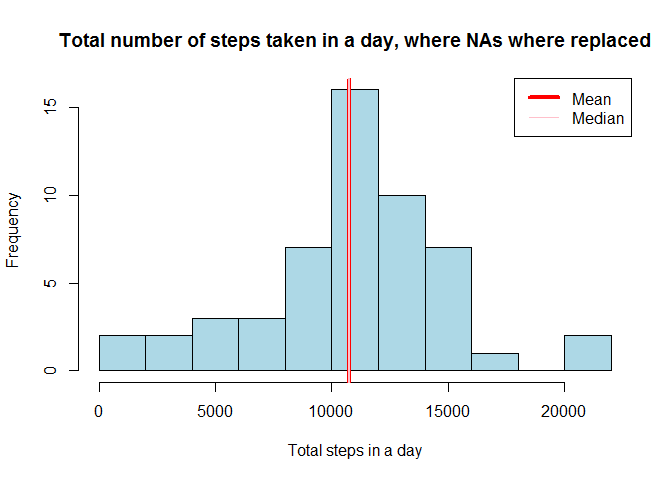

## Loading and preprocessing the data

```r
unzip("D:/Blythe/ReproducibleResearch/week2/RepData_PeerAssessment1/activity.zip", exdir = "Dataset")
setwd("Dataset")
activity<- read.csv("activity.csv")
```
## What is mean total number of steps taken per day?

```r
sumperday<- aggregate(steps~date, data=activity, FUN=sum, na.rm=TRUE)
m1 <- formatC(mean(sumperday$steps, na.rm=TRUE), format="f", digits=0)
m2 <- median(sumperday$steps, na.rm=TRUE)

hist(sumperday$steps, breaks=8, col="lightgreen", main="Total number of steps taken in a day", xlab="Total steps in a day") 

abline(v = m1,col="red", lwd=4)

abline(v = m2, col="pink", lwd=2)

legend(x = "topright", # location of legend within plot area
 c( "Mean", "Median"),
 col = c("red", "pink"),
 lwd = c(4, 1))
```

<!-- -->


10766  and the 10765 are the mean and median, respectively, number of steps taken per day.


## What is the average daily activity pattern?


```r
intervalavg<- aggregate(steps~interval, data=activity, FUN=mean, na.rm=TRUE)
with(intervalavg, plot(interval, steps, type="l"))
```

<!-- -->

```r
max<- subset(intervalavg, intervalavg$steps==max(intervalavg$steps))$interval
```
On average the maximum number of steps is taken at the 835th interval.

## Imputing missing values

```r
NAs<- sum(is.na(activity$steps))
activity0 <- activity
activity0$steps <- ifelse(
        is.na(activity0$steps)== TRUE, intervalavg$steps[intervalavg$interval %in% activity$interval], activity0$steps) 

sumperday0<- aggregate(steps~date, data=activity0, FUN=sum, na.rm=TRUE)
m10 <- formatC(mean(sumperday0$steps, na.rm=TRUE), format="f", digits=0)
m20 <- formatC(median(sumperday0$steps, na.rm=TRUE), format="f", digits=0)

hist(sumperday$steps, breaks=8, col="lightblue", main="Total number of steps taken in a day, where NAs where replaced", xlab="Total steps in a day") 

abline(v = m1,col="red", lwd=4)

abline(v = m2, col="pink", lwd=2)

legend(x = "topright", # location of legend within plot area
 c( "Mean", "Median"),
 col = c("red", "pink"),
 lwd = c(4, 1))
```

<!-- -->


 1. The total number of missing values in the dataset is 2304

When the NA values are replaced with the average value for that interval the mean and median, number of steps taken per day are 10766  and the 10766 , respectively.
 
 
Do these values differ from the estimates from the first part of the assignment? Yes the median value, 10766 is now equal to the mean value as appose to 10765. The mean value remains unchanged. 

What is the impact of imputing missing data on the estimates of the total daily number of steps? It changes the median value to be equal to the mean value. 

## Are there differences in activity patterns between weekdays and weekends?

```r
activity0$day <- ifelse(
weekdays(as.Date(activity0$date, "%Y-%m-%d"))=="Saturday" |
        weekdays(as.Date(activity0$date, "%Y-%m-%d"))=="Sunday"
        , "weekend", "weekday")
intervalavg0<-aggregate(steps~interval + day, data = activity0, FUN = mean)
lattice::xyplot(steps ~ interval |as.factor(day), data=intervalavg0, layout=c(1, 2), type="l")
```

<!-- -->
